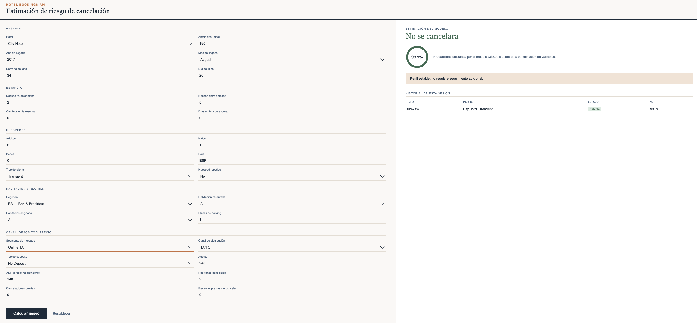

# Hotel Bookings API

API REST que sirve un modelo **XGBoost** (ROC-AUC 0,95 en test) para estimar la probabilidad de que una reserva de hotel se cancele. El análisis, la limpieza y el entrenamiento del modelo viven en el [repo de ML](https://github.com/mrguezrodriguez/ML_hotel_bookings); este repositorio cubre la parte de productivización: API, empaquetado del modelo, contenedor y despliegue.

**API pública:** https://hotel-bookings-api.onrender.com · **Docs interactivas:** https://hotel-bookings-api.onrender.com/docs

> El plan gratuito de Render "duerme" el servicio tras un rato de inactividad. Mientras dure la corrección hay un ping a `/health` cada 5 minutos configurado en [cron-job.org](https://cron-job.org) para que no llegue a dormirse.

## Interfaz web

Además de los endpoints REST, el servicio expone una interfaz web mínima en `/app`, pensada para probar el modelo sin necesidad de `curl` ni Swagger:

🖥️ **Demo en vivo**: https://hotel-bookings-api.onrender.com/app

Permite rellenar los datos de una reserva desde un formulario, ver la predicción del modelo (etiqueta, probabilidad y recomendación) y consultar el historial de las predicciones hechas durante la sesión. Es una capa de productivización sobre la misma API — no cambia el modelo ni el pipeline, solo hace que el servicio sea usable por alguien no técnico sin pasar por la documentación de Swagger.



## Cómo se usa

| Endpoint | Descripción |
|---|---|
| `GET /` | Landing: explica cómo usar el resto de endpoints |
| `GET /health` | Comprueba que el servicio está vivo |
| `GET /predict` | Predicción pasando los datos por query string |
| `POST /predict` | Predicción pasando los datos en un JSON |
| `GET /docs` | Documentación interactiva (Swagger) |

Todos los campos son opcionales: los que no se envíen usan el valor por defecto de una reserva de ejemplo, así que un `requests.get` sin parámetros ya devuelve una predicción real.

```python
import requests

r = requests.get(
    "https://hotel-bookings-api.onrender.com/predict",
    params={"lead_time": 350, "deposit_type": "Non Refund"},
)
print(r.json())
```

Un tercer endpoint, `GET /modelo` (ficha técnica del modelo: algoritmo, nº de features, pasos del pipeline), está comentado en `app/main.py` — pensado para descomentar y redesplegar en directo como demo del flujo de CI.

## Cómo se levanta

### Local

```bash
git clone https://github.com/mrguezrodriguez/hotel-bookings-api.git
cd hotel-bookings-api
python -m venv .venv
.venv\Scripts\Activate.ps1        # Windows / Git Bash
pip install -r requirements.txt
uvicorn app.main:app --reload
```

La API queda en `http://localhost:8000`. Para lanzar la suite de pruebas contra cualquier URL:

```bash
python tests/test_api.py http://localhost:8000
```

### Docker

```bash
docker build -t mariarguezrodriguez/hotel-api:1.1.0 .
docker run -p 8000:8000 mariarguezrodriguez/hotel-api:1.1.0
```

Imagen publicada en Docker Hub: [`mariarguezrodriguez/hotel-api`](https://hub.docker.com/r/mariarguezrodriguez/hotel-api). La imagen base es `python:3.11-slim`, y `requirements.txt` se copia e instala antes que el código para aprovechar la cache de capas de Docker.

### Kubernetes

```bash
kubectl apply -f k8s/
kubectl get pods -w
```

- `deployment.apps/hotel-api` — 2 réplicas · requests `cpu: 250m` / `memory: 512Mi` · límites `cpu: 1` / `memory: 1Gi`
- `service/hotel-api-service` — tipo `NodePort`, expuesto en el puerto **30080**
- Liveness (`initialDelay: 30s`) y readiness (`initialDelay: 15s`) probes contra `GET /health`

```bash
python tests/test_api.py http://localhost:30080
```

Escalar o hacer un rolling update:

```bash
kubectl scale deployment hotel-api --replicas=4
kubectl set image deployment/hotel-api hotel-api=mariarguezrodriguez/hotel-api:1.1.0
kubectl rollout status deployment/hotel-api
```

## Qué hay dentro

```
hotel-bookings-api/
├── app/
│   ├── main.py                   # endpoints de FastAPI: /, /health, /predict (y /modelo comentado)
│   ├── predictor.py              # carga el pipeline y el modelo una vez, expone predecir()
│   ├── transformers_hotel.py     # clases custom del pipeline de ML_hotel_bookings
│   └── models/
│       ├── full_pipeline.pkl
│       └── xgboost_final.pkl
├── k8s/
│   ├── deployment.yaml
│   └── service.yaml
├── tests/
│   └── test_api.py
├── repack_model.py               # re-empaqueta el pipeline (ver nota abajo)
├── Dockerfile
├── requirements.txt              
└── README.md
```

**`transformers_hotel.py` y `repack_model.py` no son parte del modelo en sí: existen para arreglar dos problemas puntuales de sacar un pickle de un notebook a producción.**

- `transformers_hotel.py` contiene las mismas clases de preprocesado (`ColumnDropper`, `DateFeatureEngineer`, `QuantileBinner`...) que ya estaban definidas dentro de `main.ipynb`. Un `.pkl` no guarda el código de una clase, solo una referencia a "módulo.NombreDeClase" — si esas clases solo existen dentro del notebook, fuera de él no hay nada que importar y la carga del pipeline falla.
- Al guardarse desde el notebook, el pickle apuntaba a `__main__.ColumnDropper`. Al cargarlo desde la API eso rompe, porque el `__main__` de Uvicorn no es el notebook. `repack_model.py` se ejecuta una vez para volver a serializar el pipeline apuntando a `app.transformers_hotel` en vez de a `__main__`.
- Aparte, el pipeline devuelve `lead_time_bin`, `adr_bin` y `total_nights_bin` como números, pero XGBoost se entrenó con ellas como `category`. `predictor.py` las reconvierte antes de predecir para evitar el error de tipos de XGBoost.

El modelo en sí no cambia: es el XGBoost entrenado en el proyecto de ML, con ROC-AUC 0,95 en test.

## Sobre el enunciado

Este proyecto nace del Team Challenge Final de despliegue del bootcamp. Lo mínimo que pedía el enunciado era una API pública con landing (`/`) + endpoint de predicción, `requirements.txt` y un tercer endpoint comentado para un redespliegue en directo. Todo eso está cubierto; Docker y Kubernetes se añadieron encima como ejercicio de productivización.
